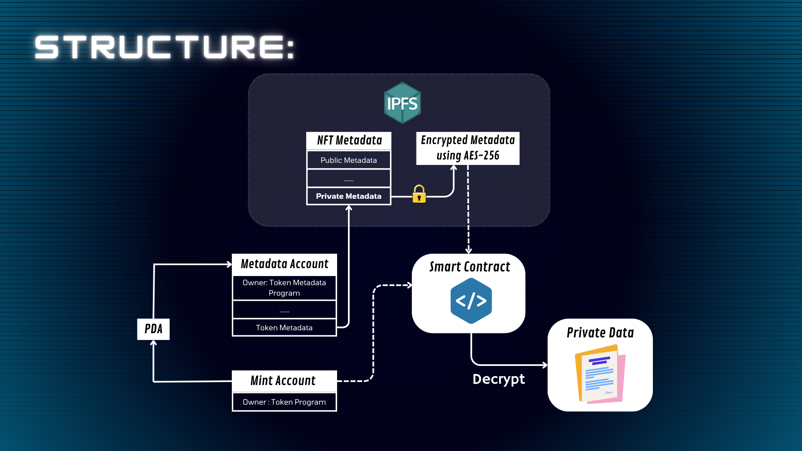
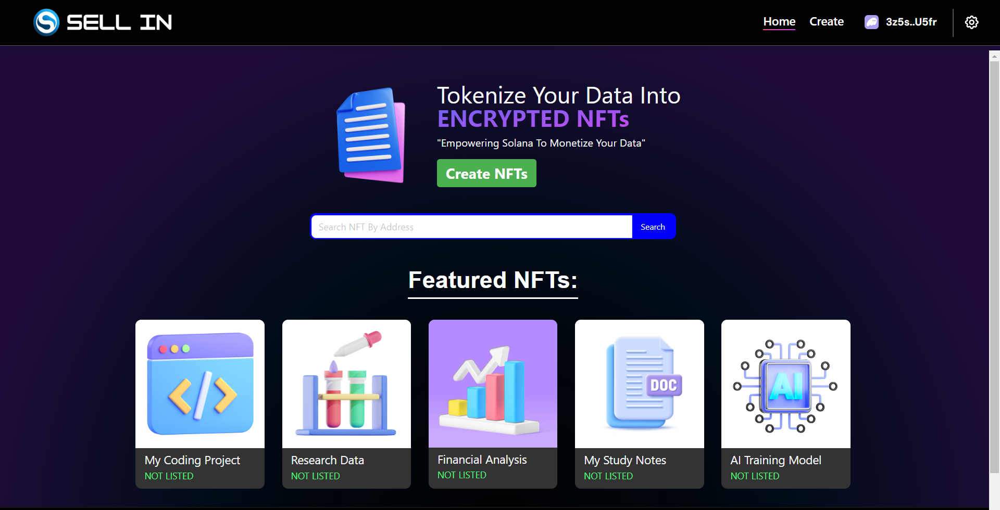
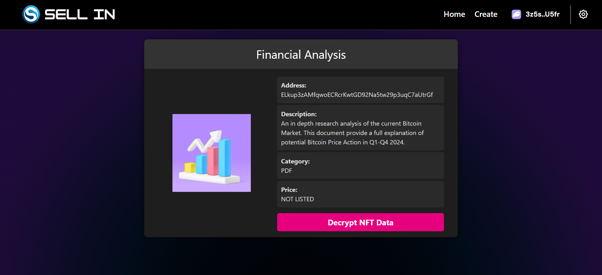
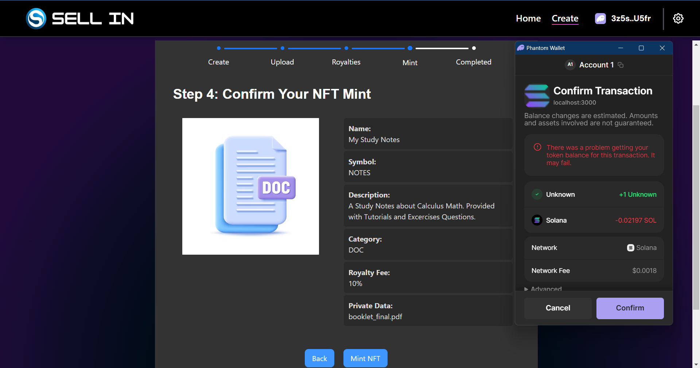

# Sell In

 

The Decentralized Marketplace to Tokenize and Monetize your data into Encrypted NFTs.

## Links:
- [Demo Video (1 minute)](https://youtu.be/fMATQ2lzTsE?si=-9o-uvqoKMtaHpYu)
- [Pitch Video (1minute)](https://youtu.be/WPAjbi36pOY?si=6CmTWjXPaXoHJeMG)

## Empowering Encrypted NFTs for Secure Tokenized Data:


This is How Your Data Looks Like On IPFS:


## Display

Sell In Home Page
 

Example NFT On Sell In
 

Minting NFTs On Sell In


*This Project Uses [Solana DApp Scaffold](https://github.com/solana-labs/dapp-scaffold/)

## Getting Started

This is a [Next.js](https://nextjs.org/) project bootstrapped with [`create-next-app`](https://github.com/vercel/next.js/tree/canary/packages/create-next-app).

The responsive version for wallets and wallet adapter may not function or work as expected for mobile based on plugin and wallet compatibility. For more code examples and implementations please visit the [Solana Cookbook](https://solanacookbook.com/)

## Installation

```bash
npm install
# or
yarn install
```

## Build and Run

Next, run the development server:

```bash
npm run dev
# or
yarn dev
```
